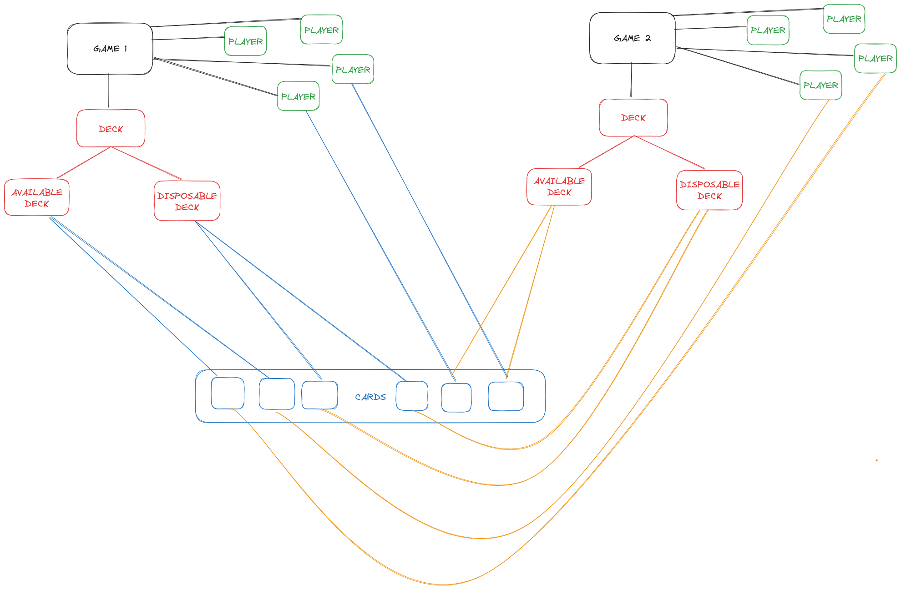

# Card: modelo, relaciones con otras entidades, uso e implementación

## Modelo

La idea de las cartas en el juego es representar **todas** las posibles, valga la redundancia, cartas existentes. Para ello, se usa esta entidad para considerar únicamente las 109 cartas (+ 2 ficticias que se explicarán a continuación).

### Explicación general

En la base de datos van a existir únicamente 109 cartas, ni más, ni menos. Esto quiere decir que una misma carta se puede relacionar con varios jugadores a la vez **sí y solo sí** estos jugadores están en **distintas** partidas.

Esto se realiza por temas de comodidad, eficiencia y ahorro de memoria dado que lo único que habría que garantizar es la unicidad de las relaciones de las cartas _dentro de la misma partida_ (esto se puede ver en los tests que hacemos).

Otro detalle a tener en cuenta es que el efecto de una carta **NO** se guarda como parte de la entidad para la BD sino que este es implementado con funciones como parte del programa, para lo cual se requiere únicamente el _tipo de carta_ (si es lanzallamas, no barbacoas, etc.).

Por ello mismo, en resúmen, consideramos que una carta se relaciona tanto con:

- Mazo de disponibles
- Mazo de descarte
- Mano del jugador

de diferentes partidas garantizando la unicidad de estas relaciones (una carta solo tiene una de las tres) dentro de una **misma partida**.



### Descripción de los modelos

```py
class Card(db.Entity):
    """Card model."""

    id = PrimaryKey(int, auto=True, unsigned=True)
    idtype = Required(int, unsigned=True)
    name = Required(str, 30)
    type = Required(
        str, default="Action"
    )  # Action, Defense, Infection, Obstacle, Panic

    available_deck = Set("AvailableDeck", reverse="cards")
    disposable_deck = Set("DisposableDeck", reverse="cards")
    players = Set("Player")
```

- `id` ==> ID de la carta en cuestión. Número en el rango [0, 109). Solo interesa a esta sección y _NO_ a otra porque es para diferenciar, por ejemplo, dos lanzallamas en la base de datos.
- `idtype` ==> ID que sí interesa tanto a esta sección como a la jugabilidad y al front. Es un número en el rango [1, 32), el cual representa la carta que se juega en sí (1 es "La Cosa", 3 es "Lanzallamas", etc.).
- `name` ==> String que representa el nombre de la carta, únicamente sirve para testear
- `type` ==> Tipo de la carta en base a las reglas del juego (Action, Defense, Infection, Obstacle, Panic)
- `available_deck` ==> Relaciones con los mazos de disponible de diferentes partidas
- `disposable_deck` ==> Relaciones con los mazos de descarte de diferentes partidas
- `players` ==> Relaciones con las manos de jugadores de distintas partidas

## ¿Cómo se va a usar?

Tal y como se explicó anteriormente, en términos de "funcionalidad" o "uso" de las cartas por módulos externos y de más alto nivel que estos, lo que es necesario saber es que se quiere jugar un lanzallamas, no cuál de esos en específicos se requiere.

Por ello mismo, entonces, lo que se usa de las cartas en módulos de más alto nivel, **siempre** es el IDTYPE.

### Hardcodeo de las cartas

Las cartas se hardcodearon de la siguiente forma (es importante saberlo para coordinar los IDTYPES):

```py
card_names = [
    ["None", "None"],
    ["The Thing", "INFECTION"],
    ["Infected", "INFECTION"],
    ["Flamethrower", "ACTION"],
    ["Analysis", "ACTION"],
    ["Axe", "ACTION"],
    ["Suspicion", "ACTION"],
    ["Determination", "ACTION"],
    ["Whisky", "ACTION"],
    ["Change of position", "ACTION"],
    ["Watch your back", "ACTION"],
    ["Seduction", "ACTION"],
    ["You better run", "ACTION"],
    ["I'm fine here", "DEFENSE"],
    ["Terrifying", "DEFENSE"],
    ["No, thanks", "DEFENSE"],
    ["You failed", "DEFENSE"],
    ["No Barbecues", "DEFENSE"],
    ["Quarantine", "OBSTACLE"],
    ["Locked Door", "OBSTACLE"],
    ["Revelations", "PANIC"],
    ["Rotten ropes", "PANIC"],
    ["Get out of here", "PANIC"],
    ["Forgetful", "PANIC"],
    ["One, two...", "PANIC"],
    ["Three, four...", "PANIC"],
    ["Is the party here?", "PANIC"],
    ["Let it stay between us", "PANIC"],
    ["Turn and turn", "PANIC"],
    ["Can't we be friends?", "PANIC"],
    ["Blind date", "PANIC"],
    ["Ups!", "PANIC"],
]
```

### Cartas "ficticias"

Se consideran **DOS** cartas ficticias, las cuales **JAMÁS** deben ser creadas en la Base de Datos. Estas dos cartas son las siguientes:

- IDTYPE 0 ==> Representa que NO hubo defensa luego de una carta de acción o intercambio
- IDTYPE 32 ==> Representa que se quiere hacer un intercambio

En la sección de "relación con otros módulos" se podrá entender para qué son necesarias y cómo es su fucionamiento.

## Implementación realizada

- BASIC CARD FUNCTIONS
	- `exists_card(id: int) -> bool` ==> Devuelve si la carta existe en la Base de Datos
	- `get_card(id: int) -> Card` ==> Devuelve la entidad de la carta con el ID referenciado
	- `create_card(id: int, idtype: int, name: str, type: str) -> Card` ==> Crea la carta en la Base de Datos en base a los parámetros colocados

- RELATIONSHIP CARD FUNCTIONS
	- `relate_card_with_available_deck(id_card: int, id_available_deck: int) -> None` ==> Relaciona una carta con un mazo de disponibles
	- `relate_card_with_disposable_deck(id_card: int, id_disposable_deck: int) -> None` ==> Relaciona una carta con un mazo de descarte
	- `relate_card_with_player(id_card: int, id_player: int) -> None` ==> Relaciona una carta con la mano de un jugador

- UNRELATIONSHIP CARD FUNCTIONS
	- `unrelate_card_with_available_deck(id_card: int, id_available_deck: int) -> None` ==> Elimina relación de la carta con ese mazo de disponibles
	- `unrelate_card_with_disposable_deck(id_card: int, id_disposable_deck: int) -> None` ==> Elimina relación de la carta con ese mazo de descarte
	- `unrelate_card_with_player(id_card: int, id_player: int) -> None` ==> Elimina relación de la carta con esa mano de cartas del jugador
