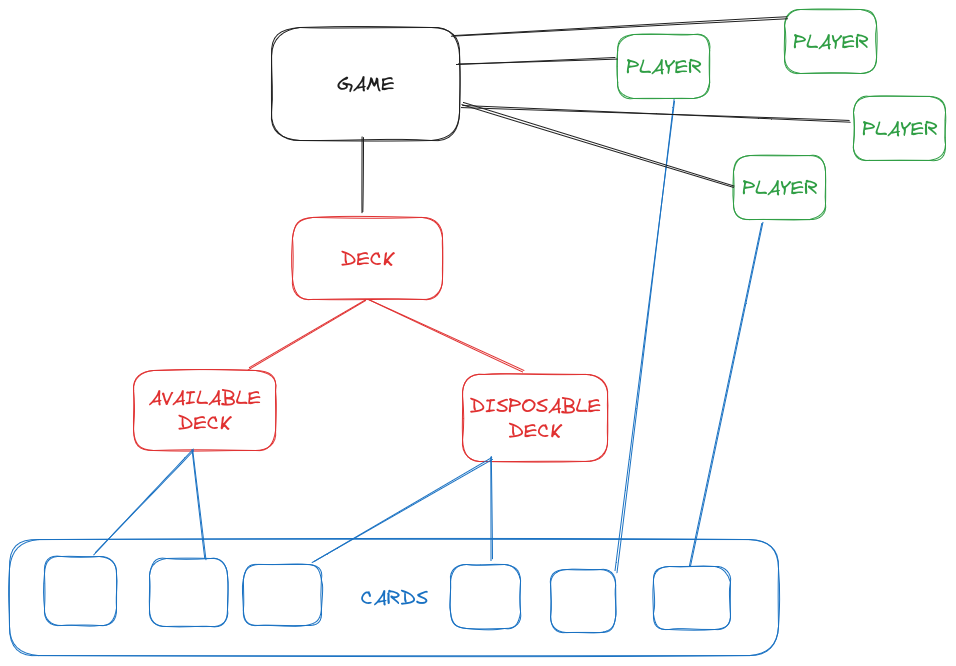

# Deck: modelo, detalle de uso e implementación

## Modelo

Tenemos **tres** tipos de mazo:

- _Deck_ ==> Mazo general del juego
- _AvailableDeck_ ==> Mazo de cartas disponibles (de donde se sacan cartas al alzar/en draw)
- _DisposableDeck_ ==> Mazo de cartas de descarte (descartadas antes por los jugadores)

Estos mazos se relacionan con **una** partida en específico, mediante:

- Conexión en la Base de Datos
- Igualdad de PK ==> El _ID_ tanto de juego, como de Deck, AvailableDeck y DisposableDeck es el **MISMO**

La vista general de cómo son los modelos de los mazos y su relación con las cartas para _una sola partida_ es el siguiente:



### Detalles de los atributos de los mazos

Los modelos de _ponyORM_ son los siguientes:

```py
class Deck(db.Entity):
    """Deck model."""

    id = PrimaryKey(int)
    available_deck = Optional("AvailableDeck")
    disposable_deck = Optional("DisposableDeck")
    game = Optional("Game")
```

- `ID` ==> ID de la partida
- `available_deck` ==> Mazo de disponibles al que se relaciona
- `disposable_deck` ==> Mazo de descarte al que se relaciona
- `game` ==> Partida con la que se relaciona

```py
class AvailableDeck(db.Entity):
    """AvailableDeck model."""

    id = PrimaryKey(int)
    deck = Optional("Deck")
    cards = Set("Card", reverse="available_deck")
```

- `ID` ==> ID de la partida
- `deck` ==> Mazo con el que se relaciona
- `cards` ==> Conjunto de cartas que contiene

```py
class DisposableDeck(db.Entity):
    """DisposableDeck model."""

    id = PrimaryKey(int)
    deck = Optional("Deck")
    cards = Set("Card", reverse="disposable_deck")
```

- `ID` ==> ID de la partida
- `deck` ==> Mazo con el que se relaciona
- `cards` ==> Conjunto de cartas que contiene

## Detalle de uso

Los mazos son usados en nuestro programa para hacer el manejo de, valga la redundancia, los mazos del juego, principalmente para las operaciones de:

- Iniciar los mazos al comienzo de una partida
- Robar una carta del mazo de disponibles
- Descartar una carta de la mano de un jugador (i.e., agregarla al mazo de descarte)
- Volver a mezclar (cuando se acabaron las disponibles, poner las descartadas mezcladas)

## Implementación

Todas las funciones relacionadas con **Deck + BD** se encuentran en el archivo `deck.py` y son las siguientes:

- BASIC DECK FUNCTIONS
	- Exists
		- `exists_deck(id: int) -> bool` ==> Devuelve si existe el mazo con ese ID en la BD
		- `exists_available_deck(id: int) -> bool` ==> Devuelve si existe el mazo de disponibles con ese ID en la BD
		- `exists_disposable_deck(id: int) -> bool` ==> Devuelve si existe el mazo de descarte con ese ID en la BD
	- Get
		- `get_deck(id: int) -> Deck` ==> Devuelve la entidad del Mazo con ese ID en la BD
		- `get_available_deck(id: int) -> AvailableDeck` ==> Devuelve la entidad del Mazo de Disponibles con ese ID en la BD
		- `get_disposable_deck(id: int) -> DisposableDeck` ==> Devuelve la entidad del Mazo de Decarte con ese ID en la BD
	- Create
		- `create_deck(id: int) -> Deck` ==> Crea el Mazo _general_ con ese ID en la base de datos y sin relación con algo en la BD
		- `create_available_deck(id: int) -> AvailableDeck` ==> Crea el Mazo de disponibles con ese ID **junto con la relación con el mazo general de mismo ID** en la BD
		- `create_disposable_deck(id: int) -> DisposableDeck` ==> Crea el Mazo de descarte con ese ID **junto con la relación con el mazo general de mismo ID** en la BD
- DECK-CARD FUNCTIONS
	- Get card
		- `get_random_card_from_available_deck(id_available_deck: int) -> Card` ==> Obtiene una carta _random_ del mazo de disponibles (_se requiere que el mazo tenga alguna carta_)
	- Move cards
		- `move_disposable_to_available_deck(id: int) -> None` ==> Esta función se usa **únicamente** cuando el mazo de disponibles no tiene cartas pero el de descarte sí. Se usa para mover todas las de descarte a la de disponibles, sacando las relaciones correspondientes.
- DELETE DECK FUNCTIONS
	- `delete_deck(id: int) -> None` ==> Elimina el mazo con ese ID de la BD
	- `delete_available_deck(id: int) -> None` ==> Elimina el mazo de disponibles con ese ID de la BD
	- `delete_disposable_deck(id: int) -> None` ==> Elimina el mazo de descartecon ese ID de la BD
